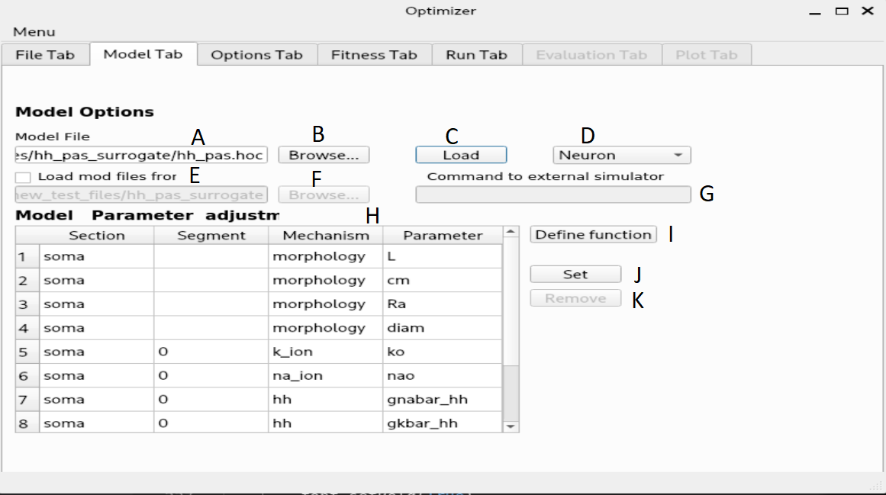
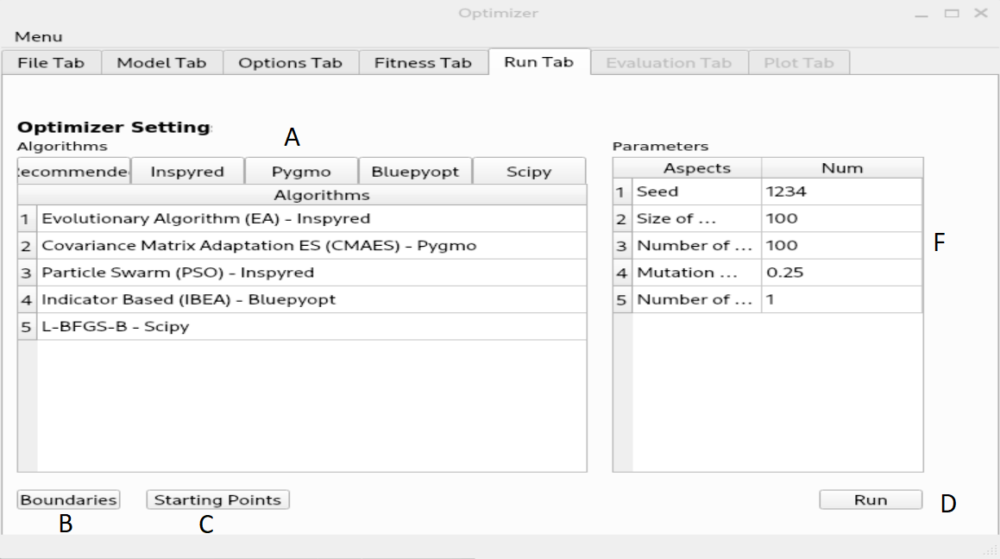
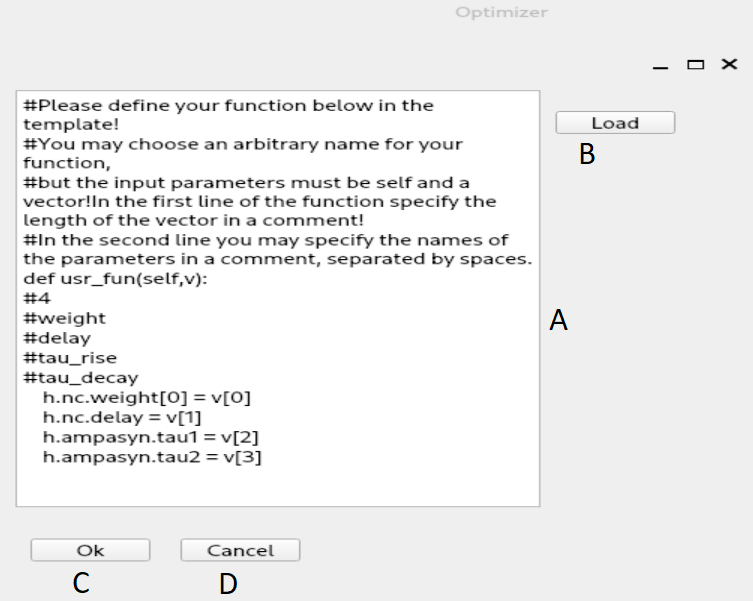

Optimizer tutorial
==================

Layer 1
-------

After the program started, the first layer will appear where the user can select the file containing the
input trace(s). The user must specify the path to this file, and the working directory (base directory)
where the outputs will be written. Apart from these the user must input the requested parameters of the
trace set he/she wants to use. After loading the selected file, the user can check if the traces were loaded
properly with the help of a plot which displays all the traces concatenated and with the help of a tree
display. The concatenation only performed for displaying purposes, the traces are otherwise handled
separately. The program only handles one input file (loading a new file will overwrite the existing one),
but with arbitrary number of traces.

.. figure:: um001.png
   :align: center

=       ========================================= 
A    	Path to input data.
B	Browse the location of the input data.
C	Input contains time or not.
D	Type of input (voltage or current trace).
E	Path to base directory (resulting files will be
 	stored here).
F	Browse the base location.
G	Input data browser (the loaded file is displayed
 	under it's type).
H	Number of traces in file (trace set).
I	Units of the data.
J	Length of trace(s). (in case of multiple traces, they
 	must have the same length)
K	Sampling frequency (in case of multiple traces,
 	they must have the same).
L	Loads the trace(s) from the given file.
M	Displays the loaded trace (if given file contains 
 	more, the trace will be concatenated for
 	displaying).
=       ========================================= 

Layer 2
-------

On the second layer the user can specify the simulator which can be Neuron or external.
If the user decided to use Neuron as the simulator then the model file must contain only the necessary
structure and mechanisms. The model can be loaded simply after selecting the model file and the
special folder where the necessary .mod files are located (optional).
As Neuron can not load it's .dlls after startup, if the special files were not found, the software must be
restarted. Once the model is loaded successfully, the content of the model will be displayed, and the
user can select the parameters by picking them int the list and pressing the “set” button. Removing a
parameter is done in a similar fashion.
At this point the user can load or define a special function which carries out different tasks during the
optimization.

=       ========================================= 
A         Path to model file.
B         Browser for model file.
C         Loads the specified model.
D         Simulator type selection (Neuron or external)
E         Path to special files (the compiled mod files for
          Neuron), this should point to a folder, which
          contains the folder of the compiled files (e.g.: to a
          folder which has an x86-64 directory)
F         Browser for special file location.
G         Here you can give the command which invokes
          the external simulator. The given command must
          consists of the following:
          - the command that calls the simulator
          - the name of the model
          - options to the simulator (optional)
          - as the last parameter, the number of parameters subject to optimization
H        Displays the recognized parameters. These can be
         selected for optimization. If the parameters you
         need, are missing, you can create a user defined
         function.
I        Opens the window to define/load your own
         function for the optimization.
J        Adds the currently selected parameter to the list of
         parameters subject to optimization.
K        Removes the parameter from the aforementioned list.
=       ========================================= 

Layer 3
-------

On the second layer the user can specify the simulator which can be Neuron or external.
If the user decided to use Neuron as the simulator then the model file must contain only the necessary
structure and mechanisms. The model can be loaded simply after selecting the model file and the
special folder where the necessary .mod files are located (optional).
As Neuron can not load it's .dlls after startup, if the special files were not found, the software must be
restarted. Once the model is loaded successfully, the content of the model will be displayed, and the
user can select the parameters by picking them int the list and pressing the “set” button. Removing a
parameter is done in a similar fashion.
As mentioned earlier the functionality of the GUI can be extended by the usage of external files.
At this point the user can load or define a special function which carries out different tasks during the
optimization.
On the next layer the settings regarding stimulation and simulation can be made. The user can select the
stimulation protocol which can be either current clamp or voltage clamp (the voltage clamp is
implemented as a SEClamp from Neuron). The stimulus type also can be selected, either step protocol
or custom waveform. If the step protocol is selected the properties of the step can be specified. In case
of multiple stimuli, only the amplitude of the stimuli can vary, no other parameter (position of stimulus,
duration, delay, etc) can be changed. Via the GUI the user can specify up to ten stimuli amplitude.
The user can make use of external files here as well by selecting the custom waveform as stimulus
type. After the stimulation parameters are selected, the user must chose a section and a position inside
that section to stimulate the model.
In the second column the parameters regarding the simulation and the recording process can be given.
The user must give an initial voltage parameter, the length of the simulation and the integration step
used for calculations (variable time step methods are not supported yet). After these settings are done,
the user can select the parameter to be measured (either current or voltage), the section and the position
where the measurement takes place.

.. figure:: um006.png
   :align: center

=     ======================================
A     Stimulation protocol (Vclamp or Iclamp).
B     Type of the stimulus (Step protocol or Custom
      Waveform).
C     Opens the window for specifying step amplitudes
      or loading custom waveform (depending on the
p     revious options).
D     Delay of stimulus onset.
E     Duration of stimulus.
F     Section which receives stimulus.
G     Point of stimulation inside the section.
H     Initial membrane potential.
I     Length of the recording.
J     Integration step size.
K     The parameter to be recorded.
L     The section where the recordings takes place.
M     Position inside the recording section.
=     ======================================

Layer 4
-------

On the next layer the combination of fitness functions can be selected with the desired weights.
Optimizer offers weight normalization with the press of a button, but not normalized values are
acceptable as well. The user can fine tune the behavior of the functions by giving parameters to them
(the value of the same parameter should be the same across the functions).

.. figure:: um008.png
   :align: center

=     ==================================
A     List of available fitness function.
B     Weight assigned to the selected function.
C     Parameters passed to the fitness functions.
D     Normalizes the weights (not necessary).
=     ==================================

Layer 5
-------

On the next layer, the user can select the desired algorithm from the current list and tune the parameters
of it. Since optimizing neuron models is a bounded optimization problem the program requires
boundaries for the parameters. The user can give a set of values as starting points to the algorithm
which will be interpreted differently, depending on the used algorithm. In the case of the global
algorithms the given set of values will be included in the initial set of parameters. In the case of the
local algorithms the algorithm will start form the point specified by the parameters.

=     ========================================
A     Seed for the random generator.
B     Selected algorithm.
C     Boundaries of the parameters subject to
      optimization.
D     Starting points
E     Run the optimization.
F     Depending on the selected algorithm, different
      settings will appear here.
=     ========================================

Layer 6
-------

.. figure:: um011.png
   :align: center

=     ===========================================
A     The resulting parameters.
B     The trace(s) obtained with the resulting
      parameters.
=     ===========================================

Layer 7
-------

.. figure:: um012.png
   :align: center

=     =============================================
A     The obtained parameters.

B     Fitness statistics (only in case of inspyred
      algorithms: Classical EO, SA)

C     Fitness components: name of fitness function; fitness value;calculated by the function; weight assigned to the function; the weighted fitness value; the resulting cumulated fitness value.

D     Displays the “state” of the population during the
      evolution. (only for inspyred algorithms)

E     Displays the alleles (only for inspyred
      algorithms ), only useful for single parameter
      tasks.

F     Displays the given proximity of the optimum.
=     =============================================

Other windows and layers
------------------------

=     ===============================================
A     Entry field for function definition.
B     Load a previously defined function from a txt.
C     Done editing, save function and continue.
D     Discard function and go back.
=     ===============================================

.. figure:: um015.png
   :align: center

=     ===============================================
A     Number of stimuli.
B     Create the specified number of stimuli.
C     Specify the amplitude of the stimuli.
=     ===============================================

=     ===============================================
A     The list of selected parameters.
B     Lower bounds.
C     Upper bounds.
D     Boundaries are set, continue.
=     ===============================================
