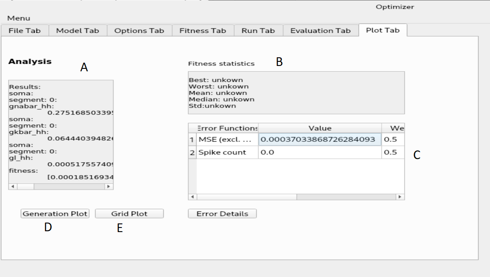
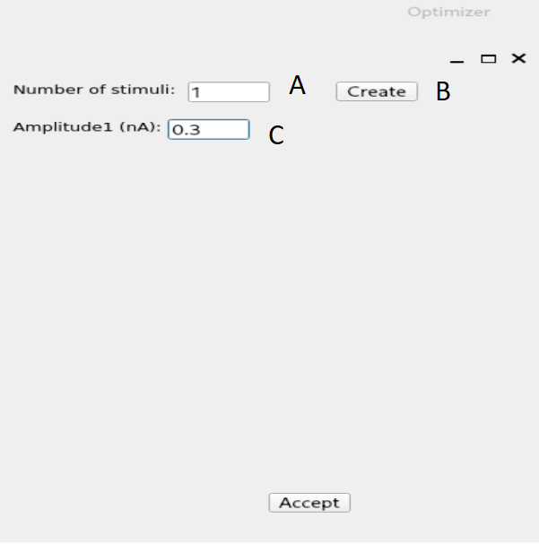

Optimizer tutorial
=================

Layer 1
-------

After the program started, the first layer will appear where the user can select the file containing the
input trace(s). The user must specify the path to this file, and the working directory (base directory)
where the outputs will be written. Apart from these the user must input the requested parameters of the
trace set he/she wants to use. After loading the selected file, the user can check if the traces were loaded
properly with the help of a plot which displays all the traces concatenated and with the help of a tree
display. The concatenation only performed for displaying purposes, the traces are otherwise handled
separately. The program only handles one input file (loading a new file will overwrite the existing one),
but with arbitrary number of traces.

.. figure:: um001.png
   :align: center

Layer 2
-------

On the second layer the user can specify the simulator which can be Neuron or external.
If the user decided to use Neuron as the simulator then the model file must contain only the necessary
structure and mechanisms. The model can be loaded simply after selecting the model file and the
special folder where the necessary .mod files are located (optional).
As Neuron can not load it's .dlls after startup, if the special files were not found, the software must be
restarted. Once the model is loaded successfully, the content of the model will be displayed, and the
user can select the parameters by picking them int the list and pressing the “set” button. Removing a
parameter is done in a similar fashion.
At this point the user can load or define a special function which carries out different tasks during the
optimization.

.. figure:: um003.png
   :align: center

Layer 3
-------

On the second layer the user can specify the simulator which can be Neuron or external.
If the user decided to use Neuron as the simulator then the model file must contain only the necessary
structure and mechanisms. The model can be loaded simply after selecting the model file and the
special folder where the necessary .mod files are located (optional).
As Neuron can not load it's .dlls after startup, if the special files were not found, the software must be
restarted. Once the model is loaded successfully, the content of the model will be displayed, and the
user can select the parameters by picking them int the list and pressing the “set” button. Removing a
parameter is done in a similar fashion.
As mentioned earlier the functionality of the GUI can be extended by the usage of external files.
At this point the user can load or define a special function which carries out different tasks during the
optimization.
On the next layer the settings regarding stimulation and simulation can be made. The user can select the
stimulation protocol which can be either current clamp or voltage clamp (the voltage clamp is
implemented as a SEClamp from Neuron). The stimulus type also can be selected, either step protocol
or custom waveform. If the step protocol is selected the properties of the step can be specified. In case
of multiple stimuli, only the amplitude of the stimuli can vary, no other parameter (position of stimulus,
duration, delay, etc) can be changed. Via the GUI the user can specify up to ten stimuli amplitude.
The user can make use of external files here as well by selecting the custom waveform as stimulus
type. After the stimulation parameters are selected, the user must chose a section and a position inside
that section to stimulate the model.
In the second column the parameters regarding the simulation and the recording process can be given.
The user must give an initial voltage parameter, the length of the simulation and the integration step
used for calculations (variable time step methods are not supported yet). After these settings are done,
the user can select the parameter to be measured (either current or voltage), the section and the position
where the measurement takes place.

Layer 4
-------

On the next layer the combination of fitness functions can be selected with the desired weights.
Optimizer offers weight normalization with the press of a button, but not normalized values are
acceptable as well. The user can fine tune the behavior of the functions by giving parameters to them
(the value of the same parameter should be the same across the functions).

.. figure:: um008.png
   :align: center

Layer 5
-------

On the next layer, the user can select the desired algorithm from the current list and tune the parameters
of it. Since optimizing neuron models is a bounded optimization problem the program requires
boundaries for the parameters. The user can give a set of values as starting points to the algorithm
which will be interpreted differently, depending on the used algorithm. In the case of the global
algorithms the given set of values will be included in the initial set of parameters. In the case of the
local algorithms the algorithm will start form the point specified by the parameters.

.. figure:: um009.png
   :align: center

Layer 6
-------

.. figure:: um011.png
   :align: center

Layer 7
-------

Other windows and layers
------------------------

.. figure:: um014.png
   :align: cente

.. figure:: um016.png
   :align: center
