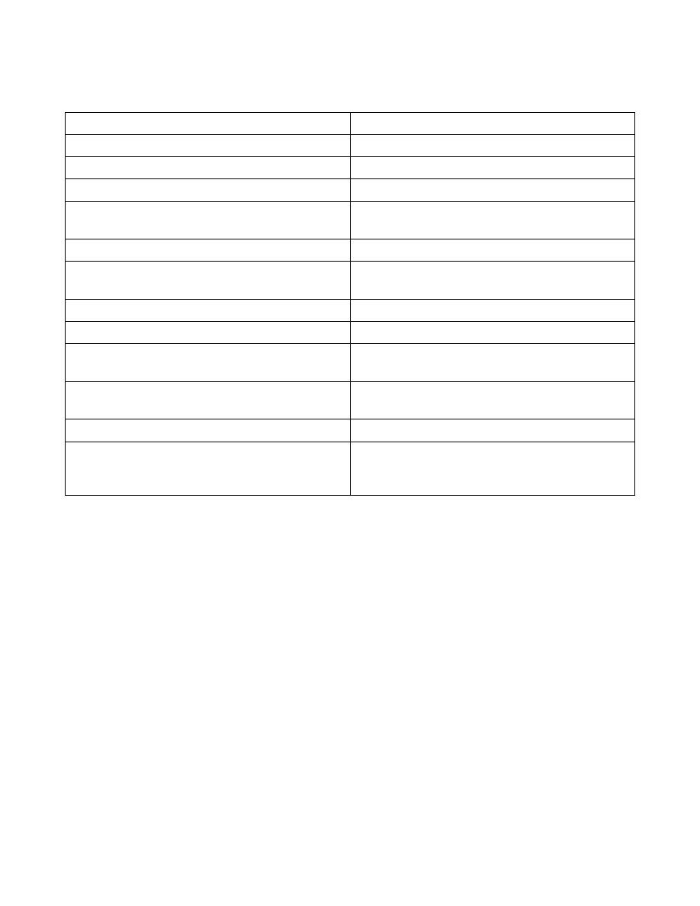

   background image
A

Path to input data.

B

Browse the location of the input data.

C

Input contains time or not.

D

Type of input (voltage or current trace).

E

Path to base directory (resulting files will be
stored here).

F

Browse the base location.

G

Input data browser (the loaded file is displayed
under it's type).

H

Number of traces in file (trace set).

I

Units of the data.

J

Length of trace(s). (in case of multiple traces, they
must have the same length)

K

Sampling frequency (in case of multiple traces,
they must have the same).

L

Loads the trace(s) from the given file.

M

Displays the loaded trace (if given file contains
more, the trace will be concatenated for
displaying).
